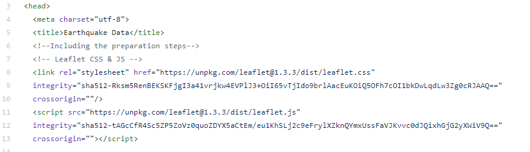
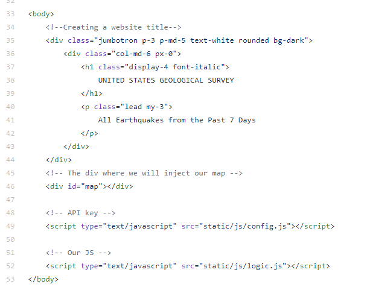
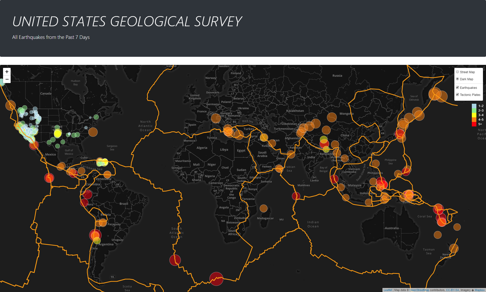
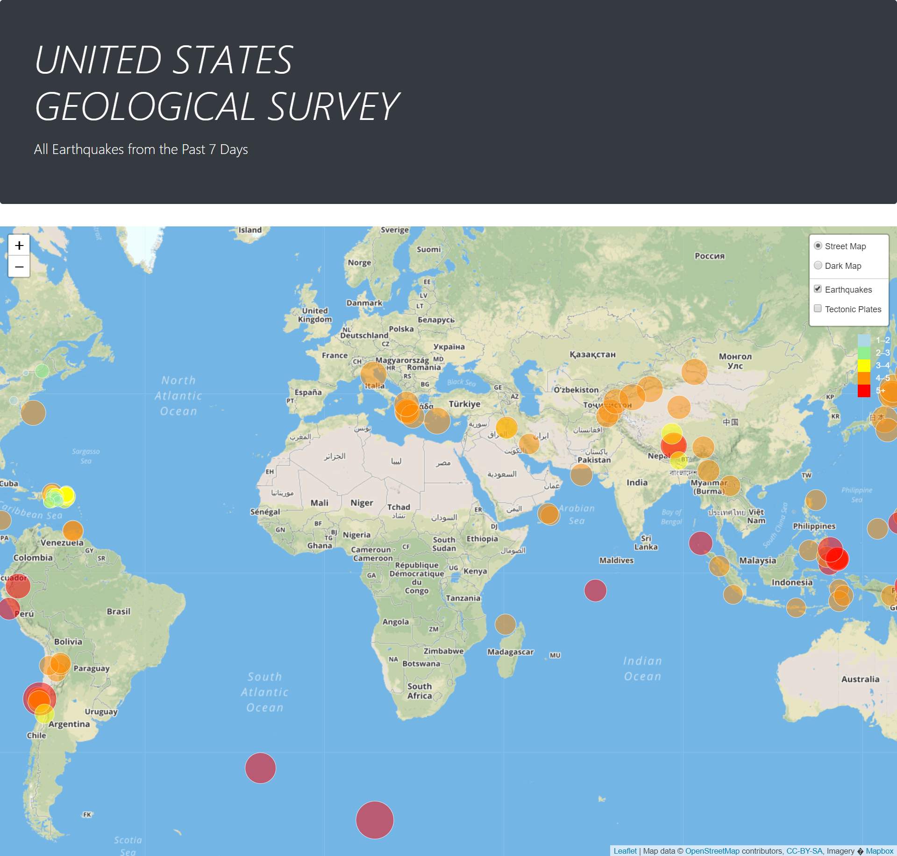
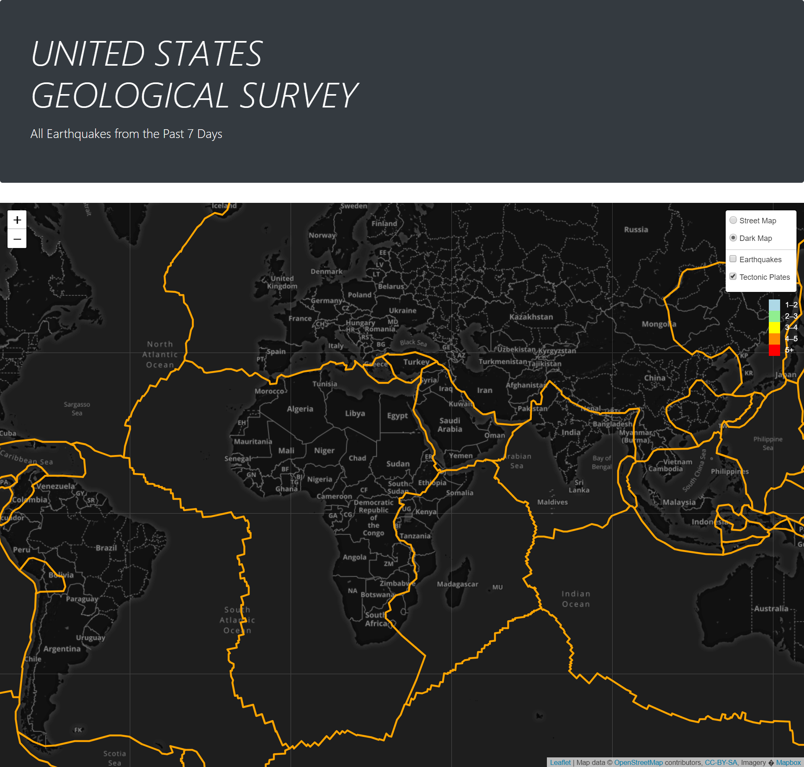

# Geomapping
This project is to build an interactive map to visualize  [USGS'](https://earthquake.usgs.gov/earthquakes/feed/v1.0/geojson.php) earthquake data using javascript's Leaflet.js library.

# Technologies used
* Leaflet.js
* HTML/CSS/Javascript
* Bootstrap

# Steps followed
#### Preparation steps - HTML
* Included leaflet css, js files in the head section

* Created a div element as a placeholder for the map

#### Javascript
* Used GeoJSON data [https://earthquake.usgs.gov/earthquakes/feed/v1.0/summary/all_week.geojson (https://earthquake.usgs.gov/earthquakes/feed/v1.0/summary/all_week.geojson)

* Created a map using Leaflet that plots all of the earthquakes from the data on their longitude and latitude
* Created data markers that reflect the magnitude of the earthquake in their size and color.
* Including popups that provide additional information about the earthquake when a marker is clicked.

* Creating a legend that will provide context for the map data.
* Plotting a second data on tectnoic plates on the map
* Adding a number of base maps to choose from as well as separate out two different data sets into overlays that can be turned on and off independently.
* Adding layer controls to the map.

## Snapshot of the webpage

